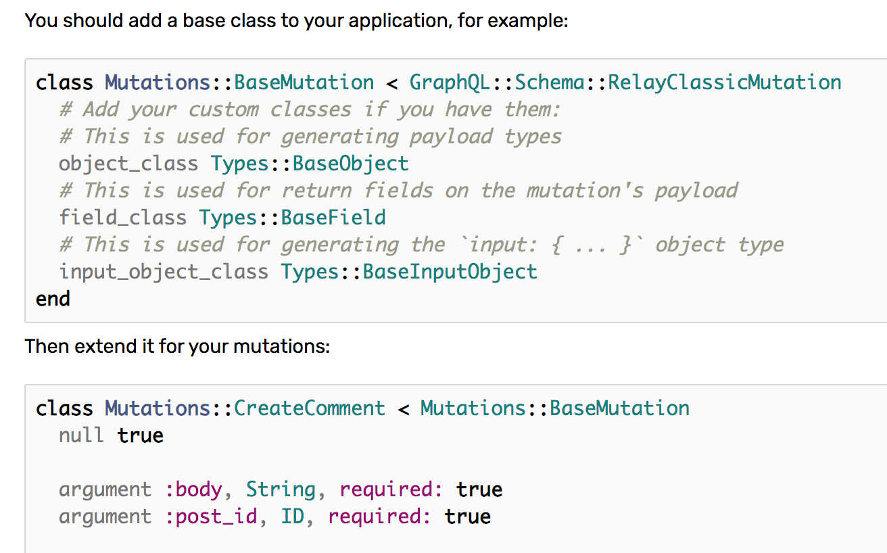
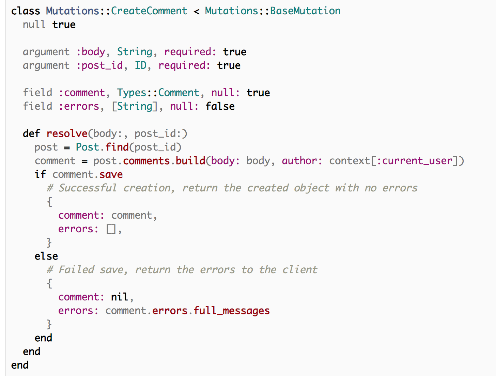
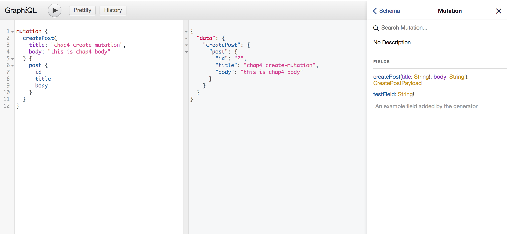
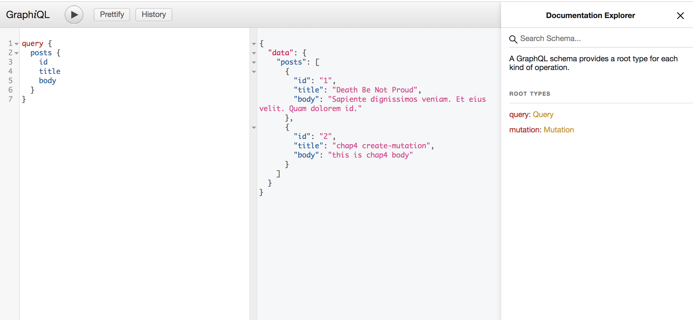

# Chap5 Mutation(CREATE)

## Todo in this chapter
- Implement feature to create post


## Step1. Run generator command


https://graphql-ruby.org/schema/generators.html#scaffolding-mutations

`terminal`
```bash hl_lines="1"
rails g graphql:mutation create_post
Running via Spring preloader in process 63092
       exist  app/graphql/mutations
   identical  app/graphql/mutations/.keep
   identical  app/graphql/types/mutation_type.rb
add_root_type  mutation
      create  app/graphql/mutations/create_post.rb
        gsub  app/graphql/types/mutation_type.rb
```

- This command creates `app/graphql/mutations/create_post.rb`
- And modify `app/graphql/types/mutation_type.rb`

`app/graphql/mutations/create_post.rb`
```ruby
module Mutations
  class CreatePost < GraphQL::Schema::RelayClassicMutation
    # TODO: define return fields
    # field :post, Types::PostType, null: false

    # TODO: define arguments
    # argument :name, String, required: true

    # TODO: define resolve method
    # def resolve(name:)
    #   { post: ... }
    # end
  end
end
```

`app/graphql/types/mutation_type.rb`
```ruby
module Types
  class MutationType < Types::BaseObject
    field :createPost, mutation: Mutations::CreatePost
    # TODO: remove me
    field :test_field, String, null: false,
      description: "An example field added by the generator"
    def test_field
      "Hello World"
    end
  end
end
```

## Step2. Create `base_mutation.rb`



https://graphql-ruby.org/mutations/mutation_classes.html#example-mutation-class

- Create `graphql/mutations/base_mutation.rb`

```ruby
# We use GraphQL::Schema::Mutation not GraphQL::Schema::RelayClassicMutation# Because I use apollo-client
class Mutations::BaseMutation < GraphQL::Schema::Mutation
end
```

## Step3. Modify /mutations/create_post.rb


https://graphql-ruby.org/mutations/mutation_classes.html#example-mutation-class

- Just imitate official docs:

`mutations/create_post.rb`
```ruby
module Mutations
  # inherit Mutations::BaseMutation
  class CreatePost < Mutations::BaseMutation
    # Define what type of value to be returned
    field :post, Types::PostType, null: false

    # Define what argument this mutation accepts
    argument :title, String, required: true
    argument :body, String, required: true

    def resolve(title:, body:)
      # we will use current_user in future
      user = User.first
      post = user.posts.new(title: title, body: body)
      # Here returns post field, which is defined above.
      if post.save
        {
          post: post,
          errors: [],
        }
      else
        # Failed save, return the errors to the client
        {
          post: nil,
          errors: post.errors.full_messages
        }
      end
    end
  end
end
```

## Step4. Test in grahpiql
### (1). createPost mutation



### (2). query posts again

- You see new post is included in response.


Finish!

